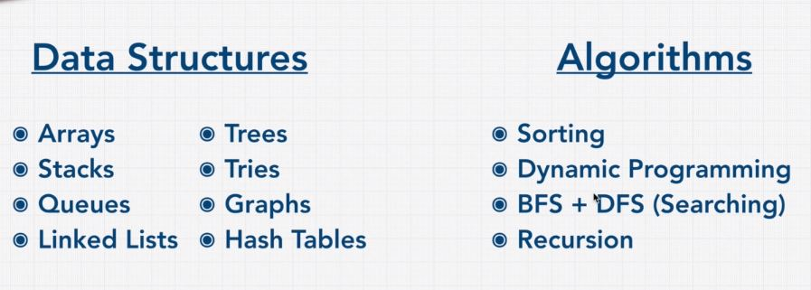

## How To Solve Coding Problems?

### 앞으로 배울 자료구조와 알고리즘 :   
#### (면접에서 다뤄지는 것 위주)

- 배열에서 공통된 요소 유무 판별 문제 [>>>](problem.js)   
- Google Interview Vedio 문제 [code >>](googleInterview.js) | [video >>](https://www.youtube.com/watch?v=XKu_SEDAykw)