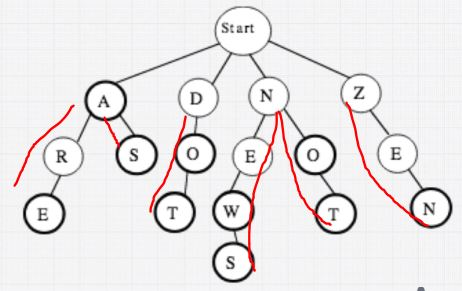

# Trees

Array, LinkedList, Stack, Queue 와 달리 일직선 구조가 아니라 부모 자식 관계를 가지는 구조

## Tree 의 종류

### Binary Tree (이진 트리)
  부모가 두 개의 자식 node 를 갖는 tree

### Binary Search Tree (이진 검색 트리)
  - "왼쪽 자식 < 부모 < 오른쪽 자식" 의 관계를 가지는 이진 트리   
  - 검색에 특화됨
  - search 의 시간복잡도 : O(log N)

### Tries (트라이)
  - **어떠한 텍스트에서 문자열이 존재하는지 검색하는데에 최적화된 트리**
  - 기존 BST 에서는 각각의 node 에서 문자열을 또 하나씩 검색해야함   
    BST 에서 문자열 search 시간복잡도 : **O (M log N)**    
    (M : 문자열의 최대 길이)   
  - **Tries 에서 문자열 search 시간복잡도 : O (M)**
  
  첫 글자를 반복 저장할 필요가 없어 공간 효율도 좋다. 

### Balance
  root node 를 기준으로 왼쪽과 오른쪽 자식들의 균형이 어느정도 맞는 tree   
  대표적인 Balanced Binary Tree : 
    - red-black tree
    - AVL tree

### Complete Binary Tree (완전 이진 트리)
  root node 를 기준으로 leaf level (마지막 레벨) 을 제외한 왼쪽과 오른쪽 자식들의 level 수가 동일해야하고   
  leaf level 은 **왼쪽부터 차례대로** 채워져 있는 이진 트리 

### Full Binary Tree
  하나의 자식 node 만 가지고 있는 부모 node 가 없는 이진 트리 (자식 0 또는 2 개)

### Perfect Binary Tree
  모든 부모 node 가 모두 두개의 자식 node 를 가지고 있고 level 도 동일 (완벽한 피라미드 형태)

## Binary Tree 의 순회 방법 3가지 [>>](./binaryTree_traverse.js)
  1. **Inorder**
    - left -> root -> right 순서   
    (left 의 최 하단 leaf node 부터 시작한다.)
  2. **Preorder**
    - root -> left -> right 순서   
    (root node 부터 시작)
  3. **Postorder**
    - left -> right -> root 순서   
    (left 의 최 하단 leaf node 부터 시작한다.)

## Heap
 최대값, 최소값 찾는 연산을 빠르게 하기 위해 고안된 완전 이진트리를 기본으로한 자료구조
 - **Min Heap**   
   : 부모 node 가 자식 node 보다 작도록 해서 가장 작은 값이 root 가 되는 heap
 - **Max Heap**   
   : 부모 node 가 자식 node 보다 크도록 해서 가장 큰 값이 root 가 되는 heap

### Heap insert()
  1. 완전 이진 트리를 유지하도록 마지막 노드에 노드 추가
  2. 부모 노드와 값 비교 후 교체 작업을 레벨 올라가며 root 까지 반복

### Heap extractMax() 또는 extractMin()
  최대값 (Max Heap 에서) 또는 최소값 (Min Heap 에서) 꺼내기
  
  1. root 값을 꺼낸다.
  2. 가장 마지막 node 를 root 로 올린다.
  3. root 와 자식들을 비교하며 정렬한다. (자식 둘 중 더 작거나 (min heap), 더 큰 값 (max heap) 과 교환)