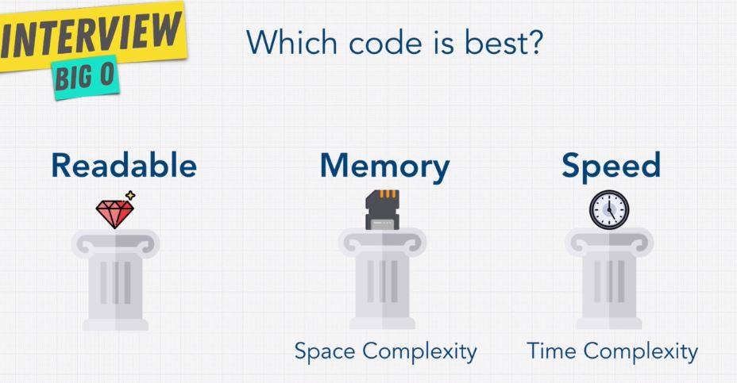

## What is good code?

1. **Scalable** (Big-O 로  측정)

   - **Speed** (time complexity) \_ CPU(Central Processing Unit)
   - **Memory** (space complexity) \_ RAM(Random Access Memory)
      > - speed 와 memory 사이에는 일반적으로 **trade-off (대립되는 균형)** 가 존재함
      > - 프로그램은 **자원**과 **시간**을 사용한다. (결국 **돈**)   
      -> *프로그램이 어느만큼의 **memory**와 **time**을 소비하는지를 아는 것은 매우 중요하다.*     
  
2. **Readable**

- **Premature Optimization (O) can be the root of all evil.**   
  **섣부른 최적화는 문제가 될 수 있다.**   
    > *: **Readable / Memory / Speed** 간 **우선순위**는 상황에 따라 달라지고 세 요소간의 **관계**는 **반비례**할 수 있기 때문*   
    > *- 좋은 개발자는 상황에 따라 **판단**할 수 있어야하며 그에 따라 **코드**를 짠다.*

## Big O cheat sheet

- Website [>>](https://www.bigocheatsheet.com/)
- PDF [>>](./reference/BigO-cheat-sheet-1.pdf)
- Chart image [>>](./references/Big-O_complexity_chart.PNG)

## Big O notation

<ol>
    <li>
        <strong>O(1)</strong>&nbsp; : Constant (상수_ no loop)
    </li>
    <li>
        O(log N)
    </li>
    <li>
        <strong>O(n)</strong>&nbsp : Linear (n item 을 for, while loop 하는 경우
    </li>
    <li>
        O(n log(n))
    </li>
    <li>
        <strong>O(n^2)</strong>&nbsp : Quadratic (두개의 nested loop (두 collection 간 모든 요소의 비교 등))
    </li>
    <li>
        O(2^n)
    </li>
    <li>
        O(n!)&nbsp : n factorial (절대 사용되면 안됨 / 모든 요소 각각에 loop 를 추가하는 경우)
    </li>
</ol>

## Big O rules

<ol>
    <li>
        Rule 1 : Worst Case (최악의 시나리오를 고려)
    </li> 
    <li>
        Rule 2 : Remove Constants (상수는 제외하고 측정)
    </li> 
    <li>
        Rule 3 : Different terms for inputs (다른 input 에 대해 다른 변수로 표현
        <blockQuote>ex) O (a + b)</blockQuote>
    </li> 
    <li>
        Rule 4 : Drop Non Dominants (덜 영향을 끼치는 항목은 제거
        )
        <blockQuote>ex) O (n^2 + n) = O (n^2)</blockQuote>
    </li> 
</ol>
